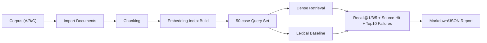

# RAG 真实场景模拟（最小集）

本目录提供一套可直接运行的检索评测闭环，用于验证你当前 RAG 管线在真实业务语料下的效果。

## 1. 场景设计

- 场景 A：运维手册问答（事实型，20 题）
- 场景 B：跨文档流程问答（多跳，20 题）
- 场景 C：版本/时间敏感问答（10 题）

评测输出包含：

- Recall@1 / Recall@3 / Recall@5
- 命中来源文档统计（按 source_name 聚合）
- 失败样例 Top10（Dense miss@5）
- Baseline（关键词检索）vs Dense（向量检索）对比和 uplift 可视

## 2. 文件结构

- `docs/rag_simulation/corpus/`: 场景语料文档
- `docs/rag_simulation/dataset_minimal.json`: 50 条评测集
- `scripts/rag_sim_prepare.py`: 数据准备（建 scope / 导入 / 分块 / 索引）
- `scripts/rag_sim_eval.py`: 评测执行（检索指标 / 溯源 / 失败样例 / 报告）
- `docs/rag_simulation/run/`: 运行产物目录（manifest、summary、traces、report）

## 3. 前置配置（真实 embedding）

为了避免 mock，请先配置 `.env`（或运行环境变量）：

```env
EMBEDDING_PROVIDER=openai
EMBEDDING_BASE_URL=https://api.openai.com/v1
EMBEDDING_API_KEY=<YOUR_KEY>
EMBEDDING_MODEL=text-embedding-3-small
EMBEDDING_BATCH_SIZE=32
EMBEDDING_TIMEOUT_SECONDS=30
```

然后启动服务：

```bash
uvicorn app.main:app --host 0.0.0.0 --port 8000
```

## 4. 执行流程

### 4.1 准备语料并建立索引

```bash
python scripts/rag_sim_prepare.py \
  --base-url http://127.0.0.1:8000 \
  --team-id rag-sim-team \
  --user-id rag-sim-user \
  --manifest-out docs/rag_simulation/run/manifest.json
```

执行成功后会打印 `conversation_id`，后续评测要用它。

### 4.2 运行评测

```bash
python scripts/rag_sim_eval.py \
  --base-url http://127.0.0.1:8000 \
  --team-id rag-sim-team \
  --conversation-id <上一步输出的conversation_id> \
  --dataset docs/rag_simulation/dataset_minimal.json \
  --manifest docs/rag_simulation/run/manifest.json \
  --output-dir docs/rag_simulation/run \
  --output-prefix eval_v1
```

### 4.3 对比优化前后两次实验（可选）

```bash
python scripts/rag_sim_compare.py \
  --before docs/rag_simulation/run/eval_baseline_summary.json \
  --after docs/rag_simulation/run/eval_optimized_summary.json \
  --out-md docs/rag_simulation/run/compare_report.md \
  --out-json docs/rag_simulation/run/compare_summary.json
```

## 5. 产物说明

- `eval_v1_summary.json`: 总体指标、按场景指标、命中来源统计、失败 Top10
- `eval_v1_traces.json`: 每题检索轨迹（hit rank / source / score）
- `eval_v1_report.md`: 可直接贴到评审/周报的可视化报告
- `compare_report.md`: 两次实验的提升对比报告

## 6. 评测流程图



## 7. 简历可复用表述（示例）

- 设计并落地 RAG 离线评测基线，构建 3 类真实业务场景共 50 条标准测试集，支持 Recall@1/3/5 与失败样例 Top10 自动产出。
- 建立 Dense vs Lexical 双轨评估，输出来源文档命中率与提升可视报告，形成可持续迭代的检索质量度量体系。
- 打通“语料导入-分块-向量索引-检索评测-报告生成”端到端流水线，支持多会话隔离评测与复现。
