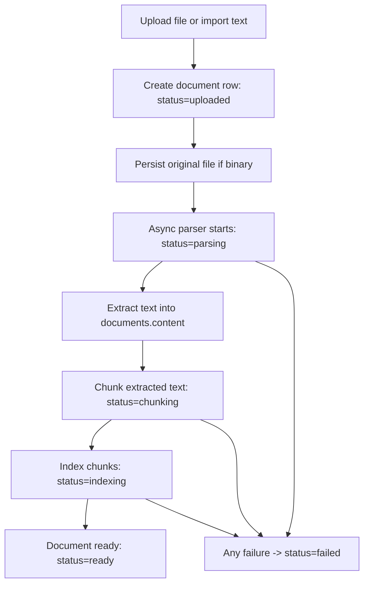

# Step 10 - Attachment Upload Design (PDF / Image / Text)

## 1. Why this step exists

The current `documents/import` flow only supports pasted or text-readable files.

Current gaps in this repo:

1. Frontend reads local files with `file.text()` and then posts JSON, so binary files never reach the backend.
2. `content_type` is limited to `txt` and `md`.
3. `documents.content` is treated as the only source of truth for chunking and retrieval.
4. Retrieval sources cannot point to PDF pages or image-origin text regions.
5. The frontend currently orchestrates `import -> chunk -> index`, which is fragile once parsing becomes asynchronous.

This step upgrades the system from "text import" to "raw file upload + async parsing + chunk/index + source preview".

## 2. Design goals

1. Support `txt`, `md`, `pdf`, `png`, `jpg`, `jpeg`, and `webp`.
2. Keep conversation-scoped attachments as the default behavior.
3. Preserve the current `document_id` based retrieval model to minimize rewrite cost.
4. Move processing ownership to the backend after upload.
5. Return richer source metadata for answer citations, especially PDF page numbers.

## 3. Non-goals for v1

1. Presigned upload URLs and object storage multipart upload.
2. Advanced layout understanding for tables/charts/forms.
3. Fine-grained OCR bounding box citations in the UI.
4. Cross-conversation library publishing workflow.

## 4. Product decisions

### 4.1 Supported file types in v1

1. `txt`, `md`: direct text extraction.
2. `pdf`: extract text layer first, fallback to OCR for image-only pages.
3. `png`, `jpg`, `jpeg`, `webp`: store original image and run OCR.

### 4.2 User-visible status

Use a single document lifecycle status:

1. `uploaded`
2. `parsing`
3. `chunking`
4. `indexing`
5. `ready`
6. `failed`
7. `deleted`

### 4.3 Backward compatibility

1. Keep `POST /api/v1/documents/import` for pasted text.
2. Add `POST /api/v1/documents/upload` for real file upload.
3. Existing `chunk` and `retrieval/index` endpoints can remain for debug/admin use, but the main web frontend should stop calling them directly.

## 5. Storage architecture

### 5.1 Durable source of truth

Use the database for metadata and extracted text, and filesystem for original files.

Recommended local storage path for this repo:

`data/uploads/<team_id>/<document_id>/original/<source_name>`

Optional derived files:

1. `data/uploads/<team_id>/<document_id>/preview/cover.png`
2. `data/uploads/<team_id>/<document_id>/preview/thumb.png`

### 5.2 Data ownership

1. Original file: filesystem
2. Extracted plain text: `documents.content`
3. Chunk data: `document_chunks`
4. Embeddings: `chunk_embeddings`

This keeps the current retrieval pipeline mostly intact because `ChunkService` still consumes `documents.content`.

## 6. Table changes

### 6.1 `documents` table

Keep the existing table and extend it instead of introducing a new attachment root entity.

Existing fields kept as-is:

1. `document_id`
2. `team_id`
3. `conversation_id`
4. `source_name`
5. `content_type`
6. `status`
7. `content`
8. `created_at`

Recommended changes:

| Field | Type | Required | Notes |
| --- | --- | --- | --- |
| `content_type` | `VARCHAR(32)` | yes | Extend allowed values to `txt`, `md`, `pdf`, `png`, `jpg`, `jpeg`, `webp` |
| `mime_type` | `VARCHAR(128)` | yes | Browser/content sniff result, such as `application/pdf` |
| `size_bytes` | `BIGINT` | yes | Original file size |
| `sha256` | `VARCHAR(64)` | yes | Used for dedupe and integrity checks |
| `storage_key` | `VARCHAR(512)` | yes | Relative or absolute path to the original file |
| `preview_key` | `VARCHAR(512)` | no | Optional preview/thumbnail path |
| `page_count` | `INTEGER` | no | Mainly for PDF |
| `failure_stage` | `VARCHAR(16)` | no | `parse`, `chunk`, `index` |
| `error_code` | `VARCHAR(64)` | no | Stable programmatic reason |
| `error_message` | `TEXT` | no | User-visible or debugging message |
| `meta_json` | `TEXT` | no | Parser output metadata, dimensions, OCR hints |
| `updated_at` | `DATETIME` | yes | Updated on every status transition |

Recommended indexes:

1. `(team_id, conversation_id, created_at desc)`
2. `(team_id, status, created_at desc)`
3. `(team_id, sha256)`

Field semantics after migration:

1. `source_name`: display file name
2. `content_type`: normalized file extension category
3. `content`: extracted plain text used for chunking and preview text mode
4. `status`: aggregate lifecycle status

### 6.2 `document_chunks` table

Keep the current table and add source location metadata so answer citations can point to PDF pages.

Existing fields kept as-is:

1. `chunk_id`
2. `document_id`
3. `team_id`
4. `chunk_index`
5. `content`
6. `start_char`
7. `end_char`
8. `created_at`

Recommended additions:

| Field | Type | Required | Notes |
| --- | --- | --- | --- |
| `page_no` | `INTEGER` | no | 1-based page number for PDF or image pseudo-page |
| `locator_label` | `VARCHAR(64)` | no | Display label such as `Page 3` |
| `block_type` | `VARCHAR(16)` | no | `paragraph`, `ocr`, `caption`, `table` |
| `meta_json` | `TEXT` | no | Optional parser block metadata |

Recommended indexes:

1. `(document_id, chunk_index)`
2. `(document_id, page_no, chunk_index)`

### 6.3 `chat_history` table

No blocking schema change is required for v1.

Reason:

1. Current `request_payload_json` already stores `selected_document_ids`.
2. Edit/regenerate paths can keep replaying against stored payload.

Optional phase-2 enhancement:

Introduce `chat_history_documents(message_id, document_id, relation_type)` for audit and faster lookup.

## 7. Migration strategy for this repo

Because this project currently uses lightweight best-effort migrations in `app/db/session.py`, the first implementation should follow the same pattern:

1. Add new nullable columns first.
2. Backfill existing text-import rows:
   - `mime_type`: map `txt -> text/plain`, `md -> text/markdown`
   - `size_bytes`: `length(content)` as a temporary backfill value
   - `sha256`: compute from existing `content` if no original file exists
   - `storage_key`: use a synthetic value such as `inline://legacy/<document_id>`
   - `updated_at`: copy from `created_at`
3. Widen `content_type` validation in schemas.
4. Expand status enum usage in frontend and backend.

## 8. Processing pipeline

### 8.1 Main flow



### 8.2 Parser behavior by type

1. `txt`, `md`
   - Decode bytes as UTF-8 first.
   - If decode fails, return `UNSUPPORTED_TEXT_ENCODING`.
2. `pdf`
   - Try embedded text extraction.
   - If one or more pages have no text, run OCR only for those pages.
   - Merge page text into `documents.content`.
   - Store `page_count`.
3. `image`
   - Persist original image.
   - OCR into plain text.
   - Set `page_no = 1` for all produced chunks.

### 8.3 Failure policy

Failures should be terminal until the user manually retries.

Recommended `error_code` values:

1. `UNSUPPORTED_FILE_TYPE`
2. `FILE_TOO_LARGE`
3. `EMPTY_FILE`
4. `UNSUPPORTED_TEXT_ENCODING`
5. `PARSE_FAILED`
6. `NO_TEXT_EXTRACTED`
7. `CHUNK_FAILED`
8. `INDEX_FAILED`

## 9. API contract

### 9.1 `POST /api/v1/documents/upload`

Purpose:

Upload one real file and immediately enqueue backend-side processing.

Request:

- Content-Type: `multipart/form-data`

Fields:

| Field | Type | Required | Notes |
| --- | --- | --- | --- |
| `team_id` | string | yes | Current team/account scope |
| `user_id` | string | yes | Needed for indexing model resolution |
| `conversation_id` | string | yes | Current conversation scope |
| `auto_index` | boolean | no | Default `true` |
| `file` | binary | yes | Original file |

Validation rules:

1. Allowed extensions: `txt`, `md`, `pdf`, `png`, `jpg`, `jpeg`, `webp`
2. Allowed MIME must match content sniff result
3. Default max file size: `20 MB`

Response `201`:

```json
{
  "document_id": "2f1b1a5d-1d65-4fd8-a7d1-1fc0a8d11355",
  "team_id": "demo",
  "conversation_id": "c0b2f7a2-3c4f-44f8-9b8e-111111111111",
  "source_name": "quarterly-report.pdf",
  "content_type": "pdf",
  "mime_type": "application/pdf",
  "size_bytes": 845231,
  "status": "uploaded",
  "page_count": null,
  "failure_stage": null,
  "error_code": null,
  "error_message": null,
  "created_at": "2026-03-23T10:00:00Z",
  "updated_at": "2026-03-23T10:00:00Z"
}
```

Behavior:

1. Create the `documents` row.
2. Save original file.
3. Return immediately.
4. Trigger parse/chunk/index in background.

### 9.2 `POST /api/v1/documents/import`

Purpose:

Keep pasted text import as a first-class shortcut for text-only input.

Request body changes:

```json
{
  "team_id": "demo",
  "user_id": "demo",
  "conversation_id": "c0b2f7a2-3c4f-44f8-9b8e-111111111111",
  "source_name": "notes.md",
  "content_type": "md",
  "content": "# Draft\nHello world",
  "auto_index": true
}
```

Behavior change from current implementation:

1. Import no longer stops at `status=pending`.
2. Backend should auto-run chunk/index after row creation.
3. Frontend should treat pasted text and file upload with the same lifecycle UI.

### 9.3 `GET /api/v1/documents`

Purpose:

List conversation-scoped documents with processing status.

Query params:

1. `team_id` required
2. `conversation_id` optional but expected in normal chat UI
3. `status` optional
4. `limit` optional, default `50`

Response item shape:

```json
{
  "document_id": "2f1b1a5d-1d65-4fd8-a7d1-1fc0a8d11355",
  "source_name": "quarterly-report.pdf",
  "content_type": "pdf",
  "mime_type": "application/pdf",
  "size_bytes": 845231,
  "status": "ready",
  "page_count": 12,
  "failure_stage": null,
  "error_code": null,
  "error_message": null,
  "created_at": "2026-03-23T10:00:00Z",
  "updated_at": "2026-03-23T10:00:05Z"
}
```

### 9.4 `GET /api/v1/documents/{document_id}`

Purpose:

Fetch one document metadata plus extracted text snippet.

Recommended response additions:

```json
{
  "document_id": "2f1b1a5d-1d65-4fd8-a7d1-1fc0a8d11355",
  "source_name": "quarterly-report.pdf",
  "content_type": "pdf",
  "mime_type": "application/pdf",
  "status": "ready",
  "page_count": 12,
  "content": "extracted plain text ...",
  "meta_json": {
    "ocr_used": true
  }
}
```

### 9.5 `GET /api/v1/documents/{document_id}/file`

Purpose:

Download or preview the original uploaded file.

Behavior:

1. PDF can open directly in browser preview.
2. Images can display directly in the drawer.
3. Legacy imported text rows without a real file may return `404` or synthesize a text download.

### 9.6 `POST /api/v1/documents/{document_id}/retry`

Purpose:

Retry parsing/chunking/indexing after a failure.

Request body:

```json
{
  "team_id": "demo",
  "user_id": "demo",
  "conversation_id": "c0b2f7a2-3c4f-44f8-9b8e-111111111111",
  "rebuild": true
}
```

Behavior:

1. Reset `error_code`, `error_message`, `failure_stage`
2. Set `status = uploaded`
3. Re-run parse/chunk/index

### 9.7 `DELETE /api/v1/documents/{document_id}`

Behavior:

1. Delete original file
2. Delete chunk rows
3. Delete embeddings
4. Delete document row

### 9.8 `POST /api/v1/chat/ask`

No breaking request change is required.

Keep using:

1. `selected_document_ids`
2. `conversation_id`
3. `model`
4. `embedding_model`

Recommended response source extension:

```json
{
  "document_id": "2f1b1a5d-1d65-4fd8-a7d1-1fc0a8d11355",
  "source_name": "quarterly-report.pdf",
  "chunk_id": "08cf...",
  "chunk_index": 6,
  "page_no": 3,
  "locator_label": "Page 3",
  "snippet": "Revenue grew 18% year over year ...",
  "score": 0.9123
}
```

Frontend effect:

1. Source pills can display `Page 3`.
2. Preview drawer can jump to the original file or extracted text section.

## 10. State machine

### 10.1 Aggregate state transitions

| Current state | Event | Next state | Notes |
| --- | --- | --- | --- |
| none | upload/import created | `uploaded` | Row exists, file stored or inline text saved |
| `uploaded` | parser starts | `parsing` | Background task starts |
| `parsing` | text extracted | `chunking` | `documents.content` ready |
| `chunking` | chunks persisted | `indexing` | Existing embeddings cleared if needed |
| `indexing` | embeddings done | `ready` | Searchable |
| `uploaded/parsing/chunking/indexing` | any fatal error | `failed` | Set `failure_stage`, `error_code`, `error_message` |
| `failed` | retry | `uploaded` | Restart lifecycle |
| any live state | delete | `deleted` or hard delete | Repo currently prefers hard delete |

### 10.2 Frontend selection rules

1. `ready`: selectable for chat retrieval
2. `uploaded`, `parsing`, `chunking`, `indexing`: visible but not selectable
3. `failed`: visible with retry affordance

## 11. Frontend interaction sketch

### 11.1 Composer area

```text
+-------------------------------------------------------------------+
| CaiBao                                                            |
|                                                                   |
| [Attachment: report.pdf Ready] [Attachment: receipt.jpg Parsing]  |
|                                                                   |
| Ask a question about the selected files...                        |
|                                                                   |
| [ + ]                                              [ Send ]       |
+-------------------------------------------------------------------+
```

Interaction rules:

1. Clicking `+` opens:
   - `Upload file`
   - `Paste text`
2. Uploaded files appear immediately as chips.
3. Only `ready` chips can be toggled on/off for retrieval.
4. Non-ready chips show state text instead of selection state.

### 11.2 Attachment list in sidebar or strip

```text
+------------------------------------------------------+
| Attachments                                           |
|------------------------------------------------------|
| report.pdf        Ready       12 pages     [Preview] |
| invoice.png       Parsing                   [View]    |
| notes.md          Failed: OCR timeout       [Retry]   |
+------------------------------------------------------+
```

### 11.3 Preview drawer

For PDF:

```text
+------------------------------------------------------+
| quarterly-report.pdf                                 |
| Status: Ready | Type: PDF | Page: 3 / 12            |
|------------------------------------------------------|
| [Browser PDF preview area or iframe]                |
|------------------------------------------------------|
| Extracted text snippet from current cited chunk      |
+------------------------------------------------------+
```

For image:

```text
+------------------------------------------------------+
| receipt.jpg                                          |
| Status: Ready | Type: Image                          |
|------------------------------------------------------|
| [Image preview]                                      |
|------------------------------------------------------|
| OCR text                                             |
+------------------------------------------------------+
```

### 11.4 Message citations

Source pill rendering:

```text
[quarterly-report.pdf | Page 3]
[receipt.jpg | OCR]
```

Click behavior:

1. Open preview drawer
2. If `page_no` exists, jump to that page
3. Show extracted snippet in context

## 12. Recommended frontend behavior changes in this repo

### 12.1 Keep

1. Current attachment strip concept
2. Current `selected_document_ids` request shape
3. Current preview drawer interaction

### 12.2 Change

1. Stop using `file.text()` for all uploads
2. Stop calling `/documents/{id}/chunk` directly from the browser
3. Stop calling `/retrieval/index` directly from the browser
4. Replace local `inferContentType()` hard block with backend-validated upload flow
5. Add polling or periodic refresh for document status after upload

### 12.3 Minimal polling strategy

After upload/import:

1. Insert returned document row into local state
2. Poll `GET /api/v1/documents?conversation_id=...` every `2s`
3. Stop polling when all newly uploaded documents become `ready` or `failed`

## 13. Security and governance

1. Validate extension, MIME type, and magic bytes
2. Enforce max file size and max file count
3. Hash files with `sha256`
4. Sanitize `source_name` before writing to disk
5. Never trust browser-provided MIME alone
6. Reserve a hook for antivirus or moderation scan

## 14. Delivery phases

### Phase 1 - Practical MVP

1. Extend `documents` metadata
2. Add `POST /documents/upload`
3. Save original files to local disk
4. Parse `txt`, `md`, `pdf`, `image`
5. Run backend-side chunk/index automatically
6. Extend source response with `page_no`

### Phase 2 - Better UX

1. Add file preview endpoint
2. Add retry action for failed documents
3. Add PDF page jump in source preview
4. Add image preview plus OCR text panel

### Phase 3 - Operational hardening

1. Add dedupe by `sha256`
2. Add background worker isolation
3. Add object storage abstraction
4. Add parser metrics and failure dashboard

## 15. Implementation notes for the current codebase

These are the main modules affected when this design is implemented:

1. `app/schemas/document.py`
   - widen import schema
   - add upload schema/response fields
2. `app/api/routes/document.py`
   - add multipart upload endpoint
   - add retry/download endpoints
3. `app/services/document_service.py`
   - create metadata row
   - manage file storage path and state transitions
4. `app/services/chunk_service.py`
   - preserve page-aware chunk metadata
5. `app/services/retrieval_service.py`
   - return page-aware source metadata
6. `app/web/app.js`
   - replace `file.text()` upload path
   - convert status handling to async lifecycle
7. `app/db/session.py`
   - add best-effort migration for new columns

## 16. Final recommendation

For this repo, the best tradeoff is:

1. keep `documents` as the primary entity,
2. keep `documents.content` as extracted plain text,
3. add raw file storage and richer metadata,
4. move processing orchestration to the backend,
5. add page-aware chunk metadata for citations.

This gets PDF/image support without rebuilding the whole retrieval architecture.


已按 docs/step-10-attachment-upload-design.md 实现了图片/PDF 上传的 Phase 1 主链路，并按步骤落地了功能。

数据层扩展（地基）
新增功能：documents 增加 mime_type/size_bytes/sha256/storage_key/page_count/failure_stage/error_code/error_message/meta_json/updated_at，document_chunks 增加 page_no/locator_label/block_type/meta_json。
设计：保持 documents 仍是主实体，不重建检索架构；通过轻量迁移自动补列+回填旧数据，兼容现有库。
关键文件：document.py, document_chunk.py, session.py

后端上传接口与文件存储
新增功能：POST /api/v1/documents/upload（multipart），GET /api/v1/documents/{id}/file（下载/预览原文件）。
设计：后端校验扩展名+MIME+magic bytes，限制大小，文件落盘到 UPLOAD_ROOT_DIR，数据库存 storage_key。
关键文件：document.py, document_service.py, config.py

后端接管处理流水线（上传后自动处理）
新增功能：import/upload 后由后端异步任务自动执行 parsing -> chunking -> indexing -> ready/failed。
设计：前端不再直接调 chunk/index；失败时写入 failure_stage/error_code/error_message，便于 UI 展示和后续 retry。
关键文件：document.py, document_service.py, chunk_service.py

PDF/图片解析能力
新增功能：

txt/md：UTF-8 解码
pdf：文本层抽取（无文本时使用降级占位文本）
png/jpg/jpeg/webp：支持上传并解析（OCR可用则走 OCR，不可用自动降级）
设计：先保证链路稳定可用，再逐步增强 OCR 精度。
关键文件：document_service.py
页码来源元数据贯通到检索/聊天
新增功能：检索命中与聊天 sources 增加 page_no/locator_label。
设计：保持原 document_id + chunk_id 模型不变，只增元数据，低成本支持 PDF 页码引用。
关键文件：retrieval.py, retrieval_service.py, chat.py, rag_chat_service.py

前端上传流改造
新增功能：

文件上传改为 FormData -> /documents/upload（不再 file.text()）
粘贴文本 import 也走后端自动处理
新增状态轮询（2s）直到 ready/failed
状态与引用展示支持 uploaded/parsing/... 和 Page N
设计：前端只负责发起上传与展示状态，处理编排全部后移到后端。
关键文件：app.js, index.html, styles.css
依赖与测试
新增依赖：pypdf, Pillow, pytesseract, python-multipart。
新增测试：上传 PDF/图片用例。
验证结果：47 passed。
关键文件：requirements.txt, test_document.py